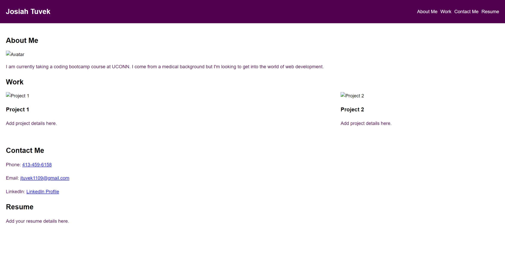

# Advanced CSS Portfolio

This is a beginner portfolio website for a web developer, showcasing their work samples and providing information about them. The portfolio includes sections for About Me, Work, Contact Me, and Resume.

## Table of Contents

- [Description](#description)
- [User Story](#user-story)
- [Acceptance Criteria](#acceptance-criteria)
- [Technologies Used](#technologies-used)
- [Installation](#installation)
- [Usage](#usage)
- [License](#license)
- [Contributing](#contributing)
- [Questions](#questions)

## Description

This portfolio website serves as a platform for a web developer to showcase their projects and skills to potential employers. It provides an easy-to-navigate interface with sections dedicated to presenting information about the developer, displaying their work samples, and providing contact details.

## User Story

As an employer, I want to view a potential employee's deployed portfolio of work samples so that I can review samples of their work and assess whether they're a good candidate for an open position.

## Acceptance Criteria

- When loading the portfolio, the user is presented with the developer's name, a recent photo or avatar, and links to sections about them, their work, and how to contact them.
- Clicking on a navigation link scrolls the UI to the corresponding section.
- Clicking on the link to the section about the developer's work scrolls the UI to a section with titled images of the developer's applications.
- The developer's first application should have a larger image size than the others.
- Clicking on the images of the applications takes the user to the deployed applications.
- The website provides a responsive layout that adapts to different viewport sizes and devices.

## Technologies Used

- HTML
- CSS
- CSS Flexbox
- Media Queries
- CSS Variables

## Installation

1. Clone the repository: `git clone <repository-url>`
2. Navigate to the project directory: `cd Advanced-CSS-Portfolio`

## Usage

1. Open the `index.html` file in a web browser.
2. Explore the different sections of the portfolio by clicking on the navigation links.
3. View the developer's work samples and click on the images to access the deployed applications.
4. Use responsive design testing tools or view the website on different devices to see how it adapts to different viewport sizes.

## Contributing

Contributions are welcome! If you find any issues or have suggestions for improvement, please create an issue or submit a pull request.

## Questions

If you have any questions or need further assistance, please feel free to contact me.

- Email: [jtuvek1109@gmail.com](mailto:jtuvek1109@gmail.com)
- Phone: [(413)459-6158](Call:(413)459-6158)

## Links
- Webpage: [https://jtuvek.github.io/Advanced-CSS-Portfolio/]
-Github: [https://github.com/jtuvek/Advanced-CSS-Portfolio.git]

